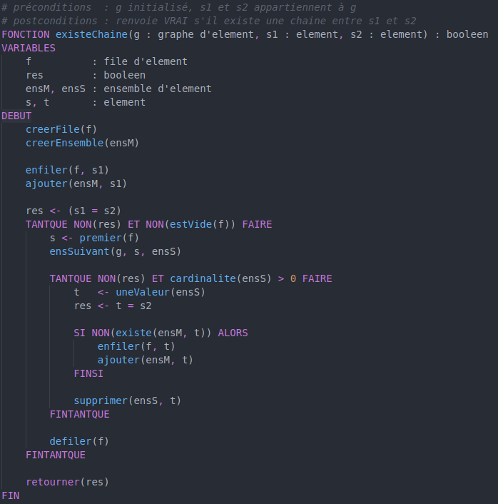

# cytech-pseudocode README

A basic extension that provides syntax highlighting for pseudocode as it is written at CYTECH. As this is a french school, this extension only supports pseudocode written in French.

## Known Issues

This is a very basic extension, so we are aware that many features are missing. If you'd like to see something in particular being added, feel free to open an issue.

## Release Notes

Initial release.

### 1.0.0

Initial release of cycode.  

Supported operators :  
<ul>
    <li>`+` `-` `*` `/`</li>
    <li>`<` `>` `=` `<=` `>=` `!=`</li>
    <li>`<-`</li>
    <li>`ET` `OU`</li>
</ul>
Supported control sequences :  
<ul>
    <li>`SI ... ALORS`</li>
    <li>`POUR ... ALLANT DE ... A ... FAIRE`<li>
    <li>`TANT QUE ... FAIRE`</li>
    <li>`NON`</li>
    <li>`RETOURNER`</li>
</ul>
Comments are prefixed by `#`  
String are between double quotes `"..."` 
Booleans are `VRAI` and `FAUX`.

## Authors
<ul>
    <li>L. DRAESCHER -- draescherl@eisti.eu</li>
    <li>V. DUSART -- dusartvict@eisti.eu</li>
</ul>